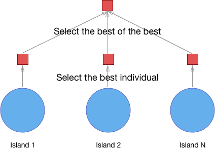
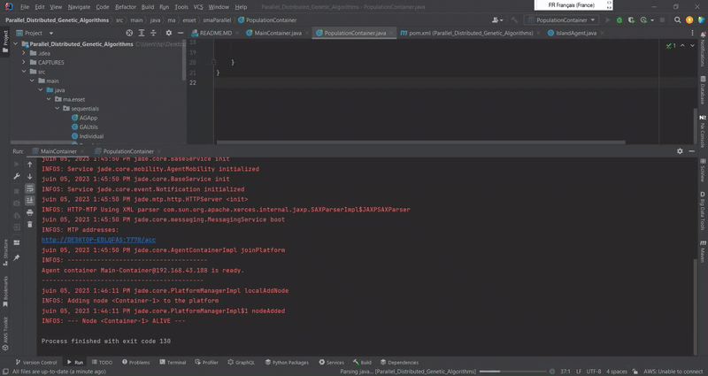

<H1>Parallel and distributed genetic algorithms</H1>

 
L'algorithme génétique parallèle est un type d'algorithme qui utilise plusieurs algorithmes génétiques pour résoudre une tâche 
unique [1]. Tous ces algorithmes tentent de résoudre la même tâche et, une fois leur travail terminé, 
le meilleur individu de chaque algorithme est sélectionné, puis le meilleur parmi eux est choisi comme solution au problème. 
C'est l'une des approches les plus populaires des algorithmes génétiques parallèles, bien qu'il en existe d'autres.
Cette approche est souvent appelée "modèle d'îles" car les populations sont isolées les unes des autres, 
comme les populations de
créatures dans la vie réelle peuvent être isolées en vivant sur différentes îles. L'image 1 illustre cela.

<H3>L'objective de ce tp est de trouver la chaine de caractère "BONJOUR SDIA" </H3>
<h3>TEST</h3>

